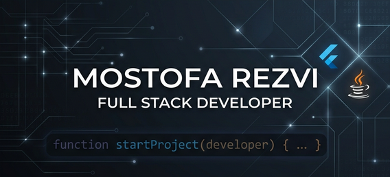

# 🌟 Hi there, I'm Mostofa Rezvi 🌟
### 🚀 Full Stack Developer | Flutter Specialist | AI Enthusiast

---

  
  
  
  

---

### 👨‍💻 About Me
I am a dedicated **Software Engineer** with a passion for building robust and scalable applications. Currently, I'm focusing my professional efforts on **Flutter Development** while expanding my horizon in **Full Stack Architecture** and **Deep Learning**. I thrive in environments that challenge my problem-solving skills and allow me to innovate.

- 🔭 **Now Breathing:** Flutter, Dart, Java, and Spring Boot.
- ⚡ **Superpowers:** Complex Problem Solving, Clean Code Architecture, State Management (BLoC).
- 🧠 **Researching:** Neural Networks and their practical applications in mobile ecosystems.
- 🎯 **Looking For:** Impactful roles in mobile development or full-stack engineering (Remote/Global).
- 💬 **Ask Me About:** Why Flutter is awesome or how to optimize backend APIs.

---

### 🛠️ My Tech Toolbox

<b>📱 Mobile Development</b>

 

  
  
  
  

<b>⚙️ Backend & Architecture</b>

 

  
  
  
  
  
  

<b>🌐 Frontend Mastery</b>

 

  
  
  
  
  

<b>🤖 AI & Research Interests</b>

 

  
  

<b>🔧 Tools & DevOps</b>

 

  
  
  
  
  

---

### 📊 GitHub Analytics

| **Commit Streak** |
| :---: |
|  |

| **Activity Overview** |
| :---: |
|  |

---

### 🎨 Design Credits
This README was designed with ❤️ to showcase professional excellence. 

  

  <i>"Simplicity is the soul of efficiency." – Austin Freeman</i>

